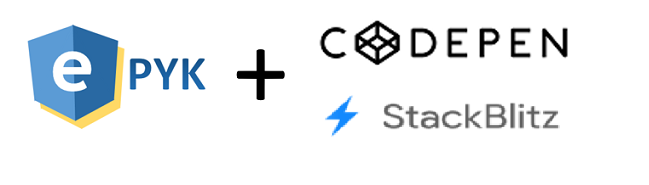

# Epyk and CodePen!

Epyk report can be shared and tested on Codepen.

## Presentation

As the main target of Epyk is to propose a fully collaborative way to develop and also share works one important milestone was
to get fully integrated with the usual web ecosystem.

As most of the implementation of Epyk have been done based on one tutorials (which are in the Framework documentation), it makes
sense to reuse those containers to test and share work

## Usage

Any report can be directly sent to codepen to share web artifacts.
The Python code will not be sent online only the ouput transpiled in JS, HTML and CSS will be linked to codepen.

This output will use [Codepen API](https://codepen.io/guuslieben/post/codepen-api-v2)

```py
from epyk.core.Page import Report

import config

# Create an empty report in the webpage
rptObj = Report()

# Creates a test button
button = rptObj.ui.button("Test", icon="fab fa-codepen")

# Add a click event on the button
button.click([rptObj.js.window.alert("test")])

# Create a second button in the report with a click event
button2 = rptObj.ui.buttons.validate("phone").click([rptObj.js.window.alert("phone")])

# Change the CSS Style of the second button
button2.css({"margin-left": '5px'})

# Transpile to JavaScriot and create a report in codepen (python will automatically open the default browser)
rptObj.outs.browser.codepen(path=config.OUTPUT_PATHS)
```
The below line of code added to a generic report will automatically open in the browser the output to a codepen.

```py
rptObj.outs.browser.codepen(path=config.OUTPUT_PATHS)
```

```py
rptObj.outs.browser.stackblitz(path=config.OUTPUT_PATHS)
```

##  Example

Running the above code will open the below Codepen Notebook to your browser.

<div align="center" >
    
</div>

Running the above code will open the below Stackblitz Notebook to your browser.

<div align="center" >
    
</div>

This will then allow you to get the result of your code and share the link in Stackoverflow for example.


## Collaborative Framework !

Epyk is first of all collaborative and per say it is fully integrated with the most common
web platform to share your code and your questions.

This is dedicated to help and support any developer par of the community.
With this design it make easy the sharing of issues or questions.

<div align="center" >
    
</div>

Most of the documentation in the code is coming from W3School website.

Do not hesitate to look at it if more details are required.
